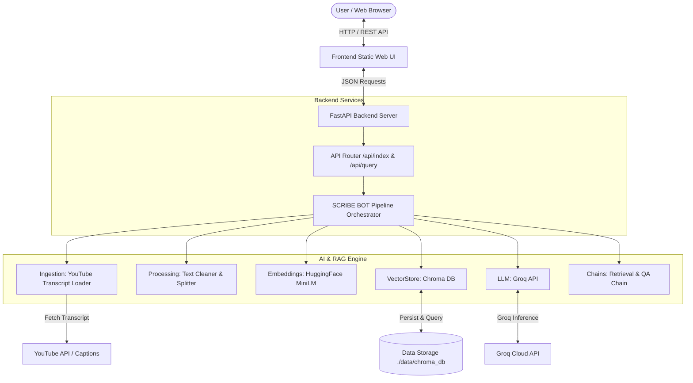

# Product Requirements Document (PRD): SCRIBE BOT

**Author**: @Arijit Dutta  
**Version**: 1.0.0  
**Status**: Approved & In Implementation  
**Project Scope**: Full-Stack RAG Web Application for YouTube Video Intelligence  

---

## 1. Executive Summary

**SCRIBE BOT** is an intelligent, high-performance Retrieval-Augmented Generation (RAG) platform designed to parse, index, summarize, and answer interactive queries against YouTube video content in real-time. By transforming unstructured video transcripts into structured vector embeddings powered by modern LLMs (Groq / Qwen / LLaMA), SCRIBE BOT provides users with instant video summaries, code extraction, and a YouTube-styled conversational AI interface.

---

## 2. Product Objectives & Core Capabilities

1. **Seamless Video Ingestion**:
   - Accept any valid YouTube video URL or ID.
   - Fetch transcripts in multiple languages with automated fallback strategies (support for 14+ primary languages and YouTube auto-captions).

2. **Time-Aware & Semantic Chunking**:
   - Clean transcript metadata, remove timing artifacts, and split text into overlapping semantic chunks (`chunk_size=512`, `chunk_overlap=256`).

3. **High-Efficiency Vector Search**:
   - Generate embeddings using lightweight HuggingFace models (`sentence-transformers/all-MiniLM-L6-v2`).
   - Store and retrieve embeddings via Chroma vector storage with FAISS compatibility layer.

4. **Groq-Powered LLM Integration**:
   - Utilize ultra-fast Groq API inference for real-time document summarization and Q&A (defaulting to `qwen/qwen3.8-27b` / `llama-3.3-70b-versatile`).

5. **YouTube-Native Web Frontend**:
   - Modern, responsive static website built with pure HTML5, CSS3, and JavaScript.
   - Designed with YouTube's dark mode aesthetic (`#0f0f0f` background, `#ff0000` accents, live-chat styled Q&A panel, embedded YouTube player, and quick prompt chips).
   - Replaces legacy Gradio UI with a custom production-ready frontend connected to a FastAPI backend.

---

## 3. System Architecture



---

## 4. Directory Structure

```text
TubeRAG/
├── PRD.md                 # Product Requirements Document
├── README.md              # Modern GitHub documentation
├── requirements.txt       # Pinned dependencies
├── .env.example           # Environment variable template
├── .gitignore             # Repository gitignore rules
├── frontend/              # YouTube-style static frontend (HTML/CSS/JS)
│   ├── index.html
│   ├── css/styles.css
│   └── js/app.js
├── backend/               # FastAPI REST Server
│   ├── __init__.py
│   ├── schemas.py
│   └── main.py
├── ai/                    # AI & RAG Pipeline Engine
│   ├── __init__.py
│   ├── ingestion/         # YouTube caption & transcript loader
│   ├── processing/        # Transcript cleaning & chunking
│   ├── embeddings/        # HuggingFace Embeddings wrapper
│   ├── vectorstore/       # Chroma vector database wrapper
│   ├── retrieval/         # Similarity search & retrieval
│   ├── llm/               # Groq LLM integration
│   ├── chains/            # LangChain QA chains & prompts
│   └── pipelines/         # High-level RAG workflow orchestrator
└── data/                  # Local storage & transcript cache (gitignored)
    └── .gitkeep
```

---

## 5. API Interface Contract

### `POST /api/index`
- **Request Payload**:
  ```json
  {
    "youtube_url": "https://www.youtube.com/watch?v=EXAMPLE_ID"
  }
  ```
- **Response Payload**:
  ```json
  {
    "status": "success",
    "message": "Video indexed successfully ✅!",
    "video_id": "EXAMPLE_ID",
    "summary": "Full AI-generated summary of the video content..."
  }
  ```

### `POST /api/query`
- **Request Payload**:
  ```json
  {
    "question": "What are the main key takeaways?",
    "chat_history": [
      {"role": "user", "content": "..."},
      {"role": "assistant", "content": "..."}
    ]
  }
  ```
- **Response Payload**:
  ```json
  {
    "answer": "Contextual answer retrieved from transcript...",
    "chat_history": [...]
  }
  ```

### `POST /api/clear`
- Resets global vector index and chat context.

### `GET /api/health`
- Health check status (`{"status": "ok", "app": "SCRIBE BOT"}`).

---

## 6. Non-Functional Requirements & Security

- **Performance**: Sub-second vector retrieval with under 2-second LLM responses via Groq.
- **Resilience**: Robust fallback transcript retrieval for missing standard captions.
- **Security & Data Isolation**: Zero hardcoded API keys in tracked repository files; `.env` and `data/` vector stores strictly gitignored.
- **Aesthetics**: High contrast YouTube dark theme, micro-interactions, responsive on desktop and mobile.
- **Maintainability**: Clear separation of concerns with modular Python packaging.

---

**Created & Maintained by**: @Arijit Dutta
